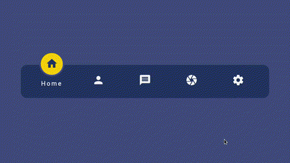

# Navigation with Indicator

This is a simple project that I created to learn about `css`.

This project is inspired by [this](https://www.youtube.com/watch?v=ArTVfdHOB-M&t=727s) tutorial :grin:

Tools that I use:
- `HTML 5`
- `CSS`
- `Vanilla JS`

# Demo
